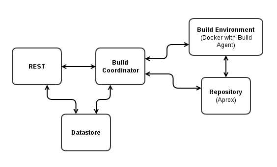

Project NewCastle
=================
 

 

???

Visit [http://project-ncl.github.io/presentations/demo-v0.4/] (http://project-ncl.github.io/presentations/demo-v0.4/) to see slides in presentation mode. 

---

Agenda
======

### - Overview and motivation

### - Main components

### - Demo

### - Modularity and Extendibility

### - Project structure

### - How to build pnc and try it out

### - Open decissions

---

Overview
========
- open source on github
    - [https://github.com/project-ncl/pnc](https://github.com/project-ncl/pnc)
- analyze community projects
    - track all maven dependencies
    - compare which artifacts are already in the system
    - track also non mvn requests
- re-use artifacts from other project
- do one build only
    - versions

---

Main components
===============

- REST & WebSockets
- OAuth (KeyCloak server)

---

Demo
====
- how ot configure a build
- trigger the build
- view collected results

---

Modularity and Extendibility
============================
- swagger
- build agents
- repository manager
- BPM

[PNC structure diagram](./images/pnc-detailed-diagram.png)

---

Project structure
=================
- PNC orchestrator
- Aprox
- Docker host
- JBPM server
- KeyCloak server

---

Project structure - maven modules
=================================
- UI
- REST / Swagger api doc
- datastore
- build-coordinator
- repository manager drivers
    - *aprox build driver*, nodejs registry, docker registry
- environment drivers
    - *Docer host* / swarm, OpenShift, local
- build drivers
    - *jenkins build driver*, pnc build agent driver, local?
- auth
- integration tests

---

How to build pnc and try it out
===============================
- clone github repo http://github.com/project-ncl/pnc/
- mvn clean install
    - produces an ear package to deploy to EAP
- set-up remote services
    - Docker host
    - Aprox repository manager
- configure settings
    - or use env variables to "fill" the default file
- remote tests disabled by default - see README
    - currently you need all remote components up and running
    - settings vs. env variables
- authentication is disabled by default
    - requires KeyCloak server

---

Open decissions
===============
- pom-manipulation and versioning
- OpenShift deployment
- persistent coordinator state
- JBPM and OAuth
- JBPM and UI integration
- new ligh-weight Build Agent replacing Jenkins
- Brew connection

---

Thanks
======

### PNC
- [https://github.com/project-ncl/pnc](https://github.com/project-ncl/pnc)

### AProx
- [https://github.com/Commonjava/aprox](https://github.com/Commonjava/aprox)

### Presentation tool used
- https://github.com/gnab/remark/

 
*Matej Lazar (mlazar@redhat.com)*
